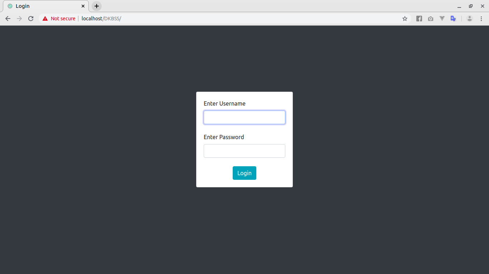
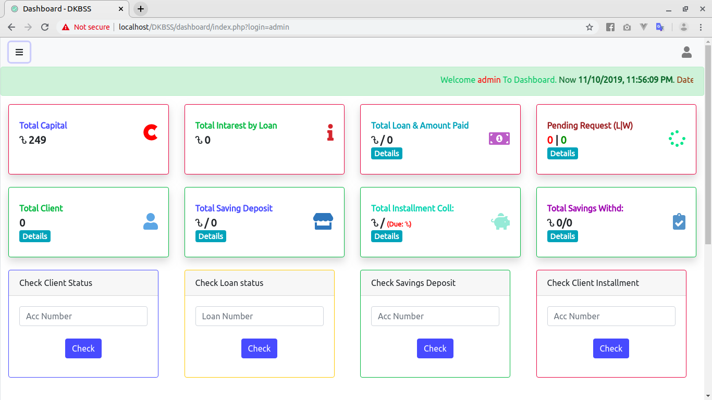
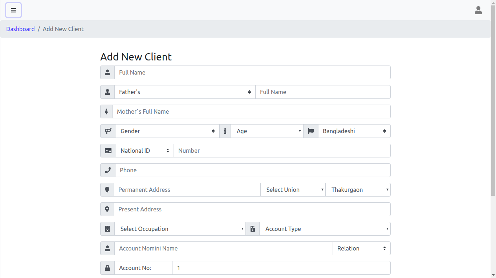
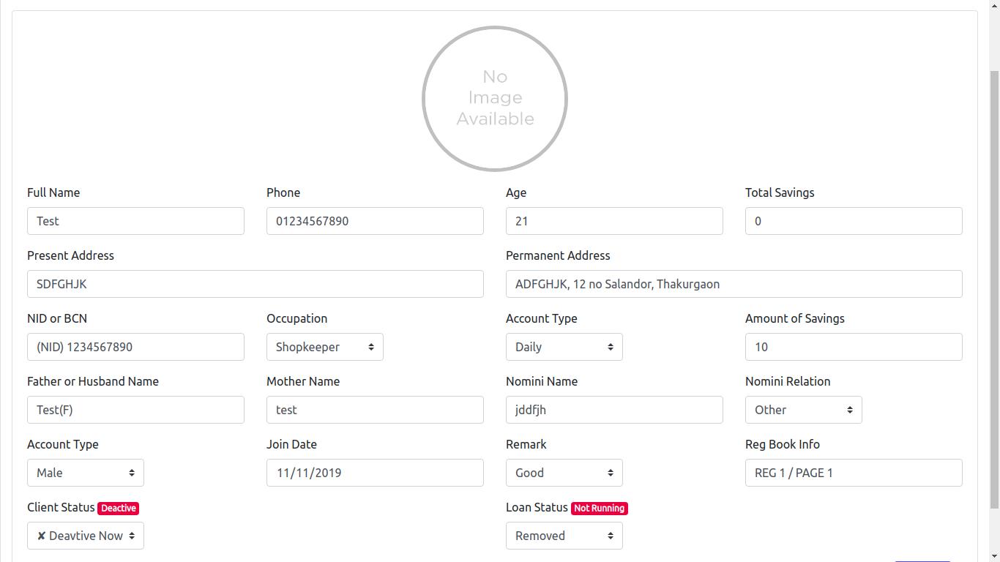
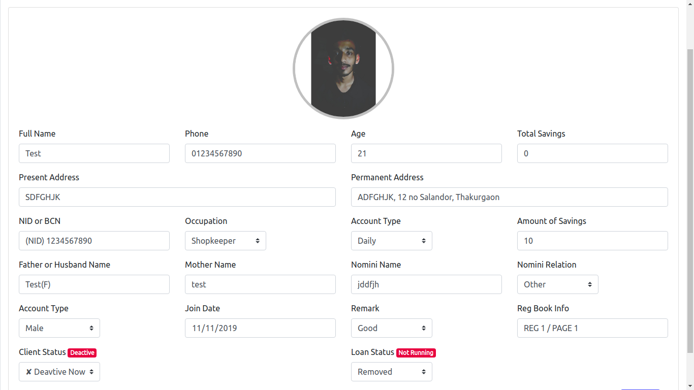
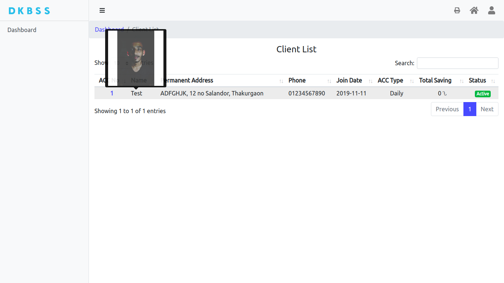

# Loan Management System (Admin-Focused)

This PHP and HTML system is all about managing loans. I built it during my 3rd semester in a 4-year diploma in engineering(Polytechnic) course. It's more for admins than users, and I didn't use any fancy design patterns back then. This project reflects my growth from a beginner coder to someone who understands the importance of design patterns.

## Features
- Admin-friendly interface for keeping an eye on finances
- Approve loan requests easily
- Keep track of installments for smooth management

## Note
This was my first real-world project, created when I was still new to programming. It was put to use by an organization in my village, helping manage loans for 20-30 clients. This hands-on experience taught me a lot about practical coding
 

### Login preview

### Dashboard preview

## Client profile creating preview

### Setup Client Profile

### Client List preview

